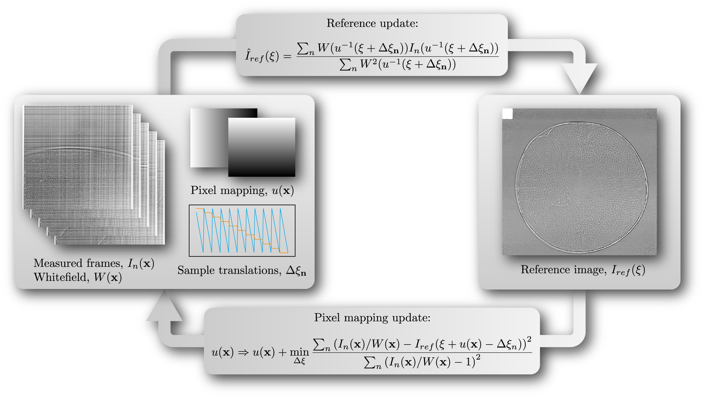

.. pyrost documentation master file, created by
   sphinx-quickstart on Fri Oct 30 16:00:08 2020.
   You can adapt this file completely to your liking, but it should at least
   contain the root `toctree` directive.

pyrost
======

|

Python Robust Speckle Tracking (**pyrost**) is a library for wavefront
metrology and sample imaging based on ptychographic speckle tracking
algorithm. This project takes over Andrew Morgan's
`speckle_tracking <https://github.com/andyofmelbourne/speckle-tracking>`_
project as an improved version aiming to add robustness to the optimisation
algorithm in the case of the high noise present in the measured data.

The library is written in Python 3 and uses a C back-end written
in `Cython <https://cython.org>`_. The library is capable to perform the robust 
version of speckle tracking algorithm, which yields an unabberated profile of
the sample and the wavefront of the lens. Also it contains a set of auxiliary
data processing routines, such as bad pixel masking, defocus sweep scan, wavefront
reconstruction, phase model fitting, etc. All of them are listed in
:class:`pyrost.STData`.

pyrost includes a framework to work with CXI files, see :doc:`reference/cxi_ref` for
more information.

pyrost.simulation
=================

**pyrost.simulation** is capable to simulate one-dimensional speckle tracking scans.
It employs Rayleigh-Sommerfeld convolution and Fraunhofer diffraction to propagate
the wavefronts. The back-end is written in C to yield the best performance.

pyrost.multislice
=================

The multislice simulation package (**pyrost.multislice**) is capable to propagate the wavefront
through a bulky sample by the dint of multislice beam propagation algorithm.
The back-end is based on FFTW library.

Python Reference
================

.. toctree::
   :maxdepth: 1

   install
   tutorials/tutorials
   reference/pyrost_api
   reference/st_sim_api
   reference/ms_sim_api

Indices and tables
==================

* :ref:`genindex`
* :ref:`modindex`
* :ref:`search`
