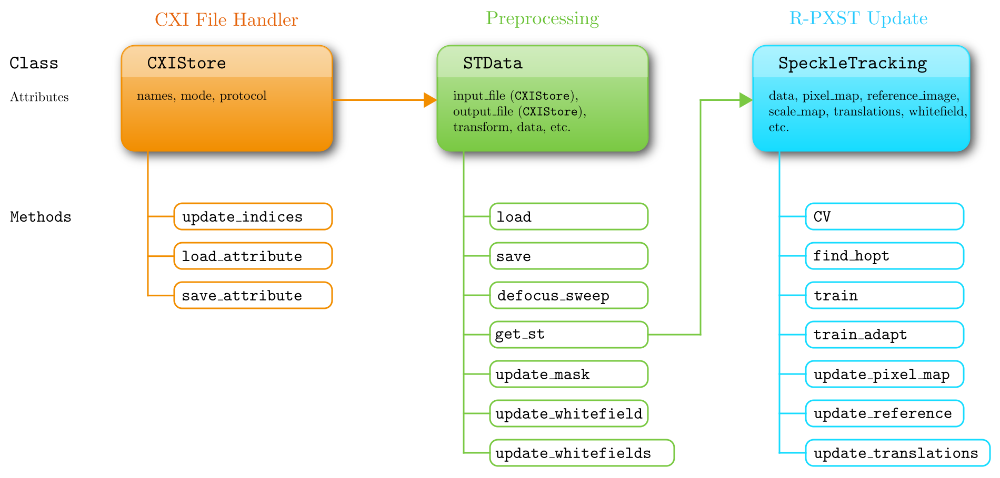

Core classes
============

   A flow diagram of the main classes and their attributes and methods in **pyrost**.

|

The following classes are central to pyrost module:

* :class:`pyrost.STData` is the main data container, which provides an interface for the preprocessing of a
  PXST dataset and can output an object, that performs the main loop of R-PXST update.
* :class:`pyrost.SpeckleTracking` performs the reference image and mapping updates and allows to perform the
  iterative R-PXST update.

:class:`STData <pyrost.STData>`
-------------------------------

:class:`pyrost.STData` contains various functions that are necessary to conduct an initial data processing
and create several maps and quantities that are needed prior to the main speckle tracking update algorithm,
such as the sample defocus or the white-field image:

* :func:`pyrost.STData.update_mask` generates a pixel mask that excludes bad and hot pixels from the following
  analysis.
* :func:`pyrost.STData.defocus_sweep` can help to estimate the focus-to-sample distance by generating a
  reference image together with calculating a mean local variance of the image for a set of distances. The mean
  local variance serves as a figure of merit of how sharp or blurry the reference image is. In the end, the
  defocus distance which yields the sharpest reference image is chosen.
* :func:`pyrost.STData.update_whitefield` generates a white-field image by taking a median through a stack of
  measured frames.
* If the white-field is dynamically varying from a frame to a frame, :func:`pyrost.STData.update_whitefields`
  method can generate a set of white-fields for each frame separately based on Principal Component Analysis
  approach [PCA]_ or by applying median filtering through a stack of frames.

:class:`SpeckleTracking <pyrost.SpeckleTracking>`
-------------------------------------------------

:class:`pyrost.SpeckleTracking` provides an interface to perform the reference image and lens wavefront
reconstruction and offers two methods (:func:`pyrost.SpeckleTracking.train`, :func:`pyrost.SpeckleTracking.train_adapt`)
to perform the iterative R-PXST update until the error metric converges to a minimum. The typical reconstruction
cycle consists of:

* Estimating an optimal kernel bandwidth for the reference image estimate (:func:`pyrost.SpeckleTracking.find_hopt`,
  in :func:`pyrost.SpeckleTracking.train_adapt` only).
* Generating the reference image (:func:`pyrost.SpeckleTracking.update_reference`).
* Updating the discrete (pixel) mapping between a stack of frames and the generated reference image
  (:func:`pyrost.SpeckleTracking.update_pixel_map`).
* Updating the sample translations vectors (:func:`pyrost.SpeckleTracking.update_translations`).
* Calculating figures of merit (:func:`pyrost.SpeckleTracking.ref_total_error`,
  :func:`pyrost.SpeckleTracking.error_profile`).

Reference image update
^^^^^^^^^^^^^^^^^^^^^^

:func:`pyrost.SpeckleTracking.update_reference` method supports Nadaraya-Watson Kernel regression [KerReg]_
estimator given by:

.. math::

    \hat{f}(x) = \frac{ \sum_{i = 1}^N K((x - x_i) / h) y_i }{ \sum_{i = 1}^N K((x - x_i) / h) },

where :math:`f(x)` is the unknown regression function, and :math:`K(x)` is the kernel function
(Gaussian kernel in our situation).

The kernel regression estimator minimizes the mean-squared-error :math:`\mathrm{MSE}(\theta)` at the point :math:`x`,
which is given by:

.. math::

    \mathrm{MSE}(\theta) = \sum_{i = 1}^N K \left( \frac{x - x_i}{h} \right) (y_i - \theta)^2 = \sum_{i = 1}^N
    K(\frac{x - x_i}{h}) (f(x_i) + \varepsilon_i - \theta)^2.

We also implemented a local weighted linear regression [LOWESS]_ estimator, which provides a better local linear
approximation by minimizing the following criterion as a function of the vector :math:`\{\theta, \beta\}`:

.. math::

    \mathrm{MSE}(\theta, \beta) = \sum_{i = 1}^N K \left( \frac{x - x_i}{h} \right)
    (y_i - \theta - (x - x_i) \beta)^2.

Pixel mapping update
^^^^^^^^^^^^^^^^^^^^

Huber regression
""""""""""""""""

:func:`pyrost.SpeckleTracking.update_pixel_map` updates the pixel mapping at each pixel separately by
minimizing the Huber loss function  as a function of the pixel and scale mapping:

.. math::

    \varepsilon_{ij}(\delta i, \delta j, s) = \frac{1}{N} \sum_{n = 1}^N \left[ s + \mathcal{H}_{1.35}
    \left( \frac{I_{nij} - W_{ij} I_\text{ref}(f_x i - u^x_{ij} - \delta i + \Delta i_n,
    f_y i - u^y_{ij} - \delta j + \Delta j_n)}{s} \right) s \right].

The minimization procedure may be performed by *grid search*, *random search* or *differential evolution*
algorithms.

Regularization
""""""""""""""

The updated pixel mapping usually requires a further regularisation by the help of weighted kernel smoothing:

.. math::

    \tilde{u}^x_{ij} = \frac{K(i, j, \sigma) * (w_{ij} u^{x\prime}_{ij})} {K(i, j, \sigma) * w_{ij}},\quad
    \tilde{u}^y_{ij} = \frac{K(i, j, \sigma) * (w_{ij} u^{y\prime}_{ij})} {K(i, j, \sigma) * w_{ij}},

where :math:`u^x_{ij}, u^y_{ij}` are the horizontal and vertical components of the pixel mapping, respectively.

Irrotationality correction
""""""""""""""""""""""""""

Since the geometric mapping between the reference plane and the detector plane is defined in terms of the
gradient of a scalar function, the curl of the mapping must be zero. Such a vector field is called 'irrotational'.
However, the pixel mapping is updated at each point separately without any examination of the irrotationality.
To ensure that the pixel mapping field is irrotational, we do the following:

* Pixel mapping is integrated with the antisymmetric derivative integration [ASDI]_
  (see :func:`pyrost.bin.ct_integrate`)
* The numerical gradient is calculated with :func:`numpy.gradient`.

Contents
--------

.. toctree::
    :maxdepth: 1

    classes/st_data
    classes/speckle_tracking
    classes/bfgs
    classes/fftw