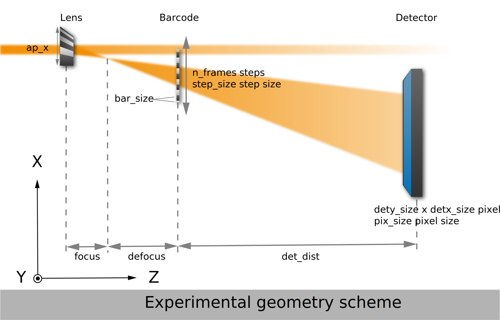

.. _st-parameters:

Simulation parameters
=====================

   
   Experimental geometry of a PXST wavefront metrology dataset generated in **pyrost.simulation**.

|

Simulation parameters class(:class:`pyrost.simulation.STParams`) for the
one-dimenional Speckle Tracking scan stores all the parameters and provides
additional methods necessary to perform the simulation. 

List of simulation parameters:

* **Experimental geometry parameters**:

  * `defocus` : Lens' defocus distance [um].
  * `det_dist` : Distance between the barcode and the
    detector [um].
  * `step_size` : Scan step size [um].
  * `n_frames` : Number of frames.

* **Detector parameters**:

  * `detx_size` : Detector's size along the horizontal axis in
    pixels.
  * `dety_size` : Detector's size along the vertical axis in
    pixels.
  * `pix_size` : Detector's pixel size [um].

* **Source parameters**:

  * `p0` : Source beam flux [cnt / s].
  * `wl` : Source beam's wavelength [um].
  * `th_s` : Source rocking curve width [rad].

* **Lens parameters**:

  * `ap_x` : Lens' aperture size along the x axis [um].
  * `ap_y` : Lens' aperture size along the y axis [um].
  * `focus` : Focal distance [um].
  * `alpha` : Third order aberrations coefficient [rad / mrad^3].
  * `ab_cnt` : Lens' aberrations center point [0.0 - 1.0].

* **Barcode sample parameters**:

  * `bar_size` : Average bar's size [um].
  * `bar_sigma` : Bar bluriness width [um].
  * `bar_atn` : Bar's attenuation coefficient [0.0 - 1.0].
  * `bulk_atn` : Barcode's bulk attenuation coefficient [0.0 - 1.0].
  * `bar_rnd` : Bar's coordinates random deviation [0.0 - 1.0].
  * `offset` : Barcode's offset at the beginning and at the end
    of the scan from the detector's bounds [um].

* **System parameters**:

  * `seed` : Seed used in all the pseudo-random number generations.
  * `num_threads` : Number of threads used in the calculations.

.. note::

    You can save parameters to an INI file with :func:`pyrost.simulation.STParams.export_ini`
    and import parameters from an INI file with :func:`pyrost.simulation.STParams.import_ini`.

The default parameters are accessed with :func:`pyrost.simulation.STParams.import_default`.
The parameters are given by:

.. code-block:: ini

    [exp_geom]
    defocus = 1e2
    det_dist = 2e6
    step_size = 0.1
    step_rnd = 0.2
    n_frames = 300

    [detector]
    detx_size = 2000
    dety_size = 1000
    pix_size = 55

    [source]
    p0 = 2e5
    wl = 7.29e-5
    th_s = 2e-4

    [lens]
    ap_x = 40
    ap_y = 2
    focus = 1.5e3
    alpha = -0.05
    ab_cnt = 0.5

    [barcode]
    bar_size = 0.5
    bar_sigma = 0.12
    bar_atn = 0.15
    bulk_atn = 0.15
    bar_rnd = 0.9
    offset = 0

    [system]
    seed = 0

.. automodule:: pyrost.simulation.st_parameters

Contents
--------

.. toctree::
    :maxdepth: 1

    classes/st_params