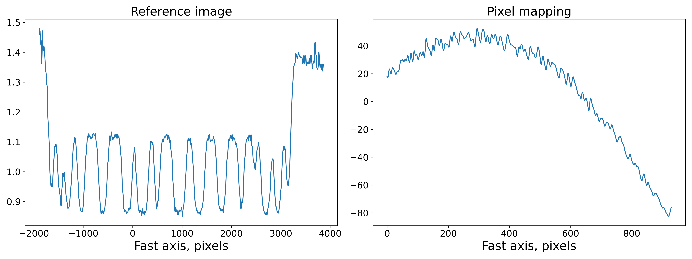
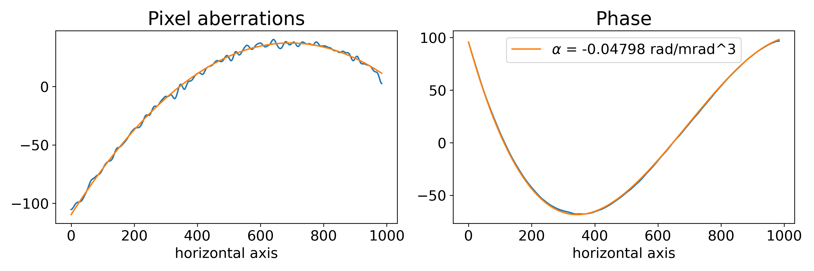

Speckle tracking reconstruction of a simulated dataset
======================================================

Speckle Tracking update procedure of one-dimensional scan doesn't differ much
from the case of two-dimensional scan. See :doc:`diatom` for an example.

1D scan CXI file
----------------
In order to obtain the file generate it using :doc:`st_sim`. The file has
the following structure:

.. code-block:: console

    $ h5ls -r sim.cxi
    /                        Group
    /entry                   Group
    /entry/data              Group
    /entry/data/data         Dataset {200/Inf, 1, 985}
    /entry/instrument        Group
    /entry/instrument/detector Group
    /entry/instrument/detector/distance Dataset {SCALAR}
    /entry/instrument/detector/x_pixel_size Dataset {SCALAR}
    /entry/instrument/detector/y_pixel_size Dataset {SCALAR}
    /entry/instrument/source Group
    /entry/instrument/source/wavelength Dataset {SCALAR}
    /speckle_tracking        Group
    /speckle_tracking/basis_vectors Dataset {200/Inf, 2, 3}
    /speckle_tracking/defocus_x Dataset {SCALAR}
    /speckle_tracking/defocus_y Dataset {SCALAR}
    /speckle_tracking/mask   Dataset {200/Inf, 1, 985}
    /speckle_tracking/pixel_translations Dataset {200/Inf, 2}
    /speckle_tracking/translations Dataset {200/Inf, 3}
    /speckle_tracking/whitefield Dataset {1, 985}

The file contains a ptychograph (set of frames summed over one of detector axes)
of 200 frames.

Loading the file
----------------
The procedure for loading the data from a file is the same as in :doc:`diatom`:

* Create a :class:`pyrost.CXIProtocol` protocol.
* Open the input file with :class:`pyrost.CXIStore` file handler. Create an output
  file. In this case the output file is the same as the input one.
* Create a :class:`pyrost.STData` R-PXST data container.
* Load all the data from the file with :func:`pyrost.STData.load`.

.. code-block:: python

    >>> import pyrost as rst
    >>> protocol = rst.CXIProtocol.import_default()
    >>> inp_file = rst.CXIStore('sim.cxi', protocol=protocol)
    >>> out_file = rst.CXIStore('sim.cxi', mode='a', protocol=protocol)
    >>> data = rst.STData(input_file=inp_file, output_file=out_file)
    >>> data = data.load()

The file already contains all the necessary attributes to perform the speckle tracking
reconstruction:

.. code-block:: python

    >>> data.contents()
    ['whitefield', 'x_pixel_size', 'files', 'y_pixel_size', 'data', 'num_threads',
     'distance', 'defocus_x', 'good_frames', 'defocus_y', 'basis_vectors', 'translations',
     'mask', 'frames', 'wavelength', 'pixel_translations']

Speckle tracking update
-----------------------
The steps to perform the speckle tracking update are also the same as in :ref:`diatom-st-update`:

* Create a :class:`pyrost.SpeckleTracking` object.
* Find an optimal kernel bandwidth with :func:`pyrost.SpeckleTracking.find_hopt`.
* Perform the iterative R-PXST update  with :func:`pyrost.SpeckleTracking.train`
  or :func:`pyrost.SpeckleTracking.train_adapt`.

.. code-block:: python

    >>> st_obj = data.get_st()
    >>> h0 = st_obj.find_hopt()
    >>> st_res = st_obj.train_adapt(search_window=(0.0, 10.0, 0.1), h0=h0, blur=8.0)

    >>> fig, axes = plt.subplots(1, 2, figsize=(8, 3))
    >>> axes[0].plot(np.arange(st_res.reference_image.shape[1]) - st_res.ref_orig[1],
    >>>              st_res.reference_image[0])
    >>> axes[0].set_title('Reference image', fontsize=20)
    >>> axes[1].plot((st_res.pixel_map - st_obj.pixel_map)[1, 0])
    >>> axes[1].set_title('Pixel mapping', fontsize=20)
    >>> for ax in axes:
    >>>     ax.tick_params(labelsize=15)
    >>>     ax.set_xlabel('Fast axis, pixels', fontsize=15)
    >>>     ax.grid(True)
    >>> plt.show()

After we successfully reconstructed the wavefront with :func:`pyrost.SpeckleTracking.train_adapt`
we are able to update the :class:`pyrost.STData` container with :func:`pyrost.STData.import_st`
method.

.. code-block:: python

    >>> data.import_st(st_res)

Phase reconstruction
--------------------
In the end we want to look at a angular displacement profile of the X-ray beam and
find the fit to the profile with a polynomial. All of it could be done with 
:class:`pyrost.AberrationsFit` fitter object, which can be obtained with
:func:`pyrost.STData.get_fit` method. We may parse the direct beam coordinate
in pixels to center the scattering angles aroung the direction of the direct beam:

.. code-block:: python

    >>> fit_obj = data.get_fit(axis=1, center=20)
    
Moreover we would like to remove the first order polynomial term from the displacement
profile with the :func:`pyrost.AberrationsFit.remove_linear_term`, since it
characterizes the beam's defocus and is of no interest to us. After that, you
can obtain the best fit to the displacement profile with :func:`pyrost.AberrationsFit.fit`
and to the phase profile with :func:`pyrost.AberrationsFit.fit_phase`:

.. code-block:: python

    >>> fit_obj = fit_obj.remove_linear_term()
    >>> fit = fit_obj.fit(max_order=2)
    >>> print(fit['c_3'])
    -0.04798021776009187

    >>> fig, axes = plt.subplots(1, 2, figsize=(8, 3))
    >>> axes[0].plot(fit_obj.pixels, fit_obj.pixel_aberrations)
    >>> axes[0].plot(fit_obj.pixels, fit_obj.model(fit['fit']))
    >>> axes[0].set_title('Pixel aberrations', fontsize=20)
    >>> axes[1].plot(fit_obj.pixels, fit_obj.phase)
    >>> axes[1].plot(fit_obj.pixels, fit_obj.model(fit['ph_fit']),
    >>>              label=r'$\alpha$ = {:.5f} rad/mrad^3'.format(fit['c_3']))
    >>> axes[1].set_title('Phase', fontsize=20)
    >>> axes[1].legend(fontsize=10)
    >>> for ax in axes:
    >>>     ax.tick_params(axis='both', which='major', labelsize=15)
    >>>     ax.set_xlabel('horizontal axis', fontsize=15)
    >>> plt.tight_layout()
    >>> plt.show()

Saving the results
------------------
In the end you can save the results to a CXI file. By default :func:`pyrost.STData.save` saves all
the data it contains. The method offers three modes:

* 'overwrite' : Overwrite all the data stored already in the output file.
* 'append' : Append data to the already existing data in the file.
* 'insert' : Insert the data into the already existing data at the set of frame indices `idxs`.

.. code-block:: python

    >>> data.save(mode='overwrite')

.. code-block:: console

    $   h5ls -r results/sim_results/data_proc.cxi
    /                        Group
    /entry                   Group
    /entry/data              Group
    /entry/data/data         Dataset {200/Inf, 1, 985}
    /entry/instrument        Group
    /entry/instrument/detector Group
    /entry/instrument/detector/distance Dataset {SCALAR}
    /entry/instrument/detector/x_pixel_size Dataset {SCALAR}
    /entry/instrument/detector/y_pixel_size Dataset {SCALAR}
    /entry/instrument/source Group
    /entry/instrument/source/wavelength Dataset {SCALAR}
    /speckle_tracking        Group
    /speckle_tracking/basis_vectors Dataset {200/Inf, 2, 3}
    /speckle_tracking/defocus_x Dataset {SCALAR}
    /speckle_tracking/defocus_y Dataset {SCALAR}
    /speckle_tracking/mask   Dataset {200/Inf, 1, 985}
    /speckle_tracking/phase  Dataset {1, 985}
    /speckle_tracking/pixel_aberrations Dataset {2, 1, 985}
    /speckle_tracking/pixel_translations Dataset {200/Inf, 2}
    /speckle_tracking/reference_image Dataset {1, 5924}
    /speckle_tracking/scale_map Dataset {1, 985}
    /speckle_tracking/translations Dataset {200/Inf, 3}
    /speckle_tracking/whitefield Dataset {1, 985}