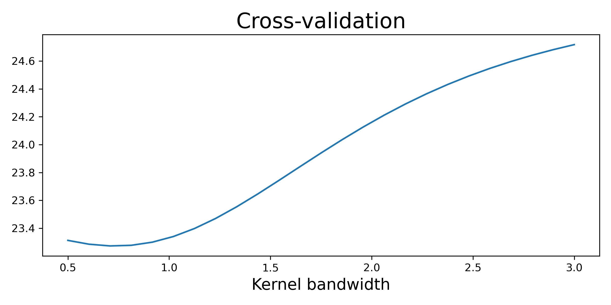

Speckle tracking reconstruction of a 2d dataset
===============================================

Diatom dataset CXI file
-----------------------
First download the `diatom.cxi <https://www.cxidb.org/data/134/diatom.cxi>`_
file from the `CXIDB <https://www.cxidb.org/>`_. The file has the following
structure:

.. code-block:: console

    $ h5ls -r diatom.cxi
    /                        Group
    /entry_1                 Group
    /entry_1/data_1          Group
    /entry_1/data_1/data     Dataset {121, 516, 1556}
    /entry_1/data_1/experiment_identifier Dataset {121}
    /entry_1/end_time        Dataset {SCALAR}
    /entry_1/experiment_identifier Dataset, same as /entry_1/data_1/experiment_identifier
    /entry_1/instrument_1    Group
    /entry_1/instrument_1/detector_1 Group
    /entry_1/instrument_1/detector_1/basis_vectors Dataset {121, 2, 3}
    /entry_1/instrument_1/detector_1/corner_positions Dataset {121, 3}
    /entry_1/instrument_1/detector_1/count_time Dataset {121, 1}
    /entry_1/instrument_1/detector_1/data Dataset, same as /entry_1/data_1/data
    /entry_1/instrument_1/detector_1/distance Dataset {SCALAR}
    /entry_1/instrument_1/detector_1/experiment_identifier Dataset, same as /entry_1/data_1/experiment_identifier
    /entry_1/instrument_1/detector_1/mask Dataset {516, 1556}
    /entry_1/instrument_1/detector_1/name Dataset {SCALAR}
    /entry_1/instrument_1/detector_1/x_pixel_size Dataset {SCALAR}
    /entry_1/instrument_1/detector_1/y_pixel_size Dataset {SCALAR}
    /entry_1/instrument_1/name Dataset {SCALAR}
    /entry_1/instrument_1/source_1 Group
    /entry_1/instrument_1/source_1/energy Dataset {SCALAR}
    /entry_1/instrument_1/source_1/name Dataset {SCALAR}
    /entry_1/instrument_1/source_1/wavelength Dataset {SCALAR}
    /entry_1/sample_1        Group
    /entry_1/sample_1/geometry Group
    /entry_1/sample_1/geometry/orientation Dataset {121, 6}
    /entry_1/sample_1/geometry/translation Dataset {121, 3}
    /entry_1/sample_1/name   Dataset {SCALAR}
    /entry_1/start_time      Dataset {SCALAR}

As we can see in :code:`entry_1/data_1/data` the file contains a two-dimensional 11x11 scan,
where each frame is an image of 516x1556 pixels.

Loading the data
----------------

CXI protocol
^^^^^^^^^^^^

Before loading the file, a CXI protocol for the file `diatom.cxi` must be created (see
:class:`pyrost.CXIProtocol` for more information). The CXI protocol must be instantiated with
the following information for all the data attributes (`data`, `whitefield`, etc) needed for
PXST data processing:

* **datatypes** : Data type of the given data attribute.
* **load_paths** : Lost of the paths inside a CXI file, where the given data attribute may be saved.
* **kind** : A kind of the data array of the given attribute (see :class:`pyrost.CXIProtocol` for
  more information).

pyrost offers a default CXI protocol via :func:`pyrost.CXIProtocol.import_default`, that contains
all the necessary data for the `diatom.cxi` file:

.. doctest::

    >>> import pyrost as rst
    >>> import numpy as np
    >>> protocol = rst.CXIProtocol.import_default()

CXI file handler
^^^^^^^^^^^^^^^^

:class:`CXIStore` is a file handler object, it accepts a :class:`pyrost.CXIProtocol` protocol and
paths to the input files and an output file. It reads the input files for all the data attributes
specified in the procotol. The file handler provides two method to load and save the data for the
specified data attrubute (:func:`pyrost.CXIStore.load_attribute` and :func:`pyrost.CXIStore.save_attribute`).

Load the CXI file into a data container :class:`pyrost.STData` with :class:`pyrost.CXILoader`.
:func:`pyrost.CXILoader.import_default` returns the default loader with the default CXI protocol
(:func:`pyrost.CXIProtocol.import_default`).

.. doctest::

    >>> files = rst.CXIStore(input_files='diatom.cxi', output_file='diatom_proc.cxi',
    >>>                      protocol=protocol)

Preprocessing of a PXST dataset
-------------------------------

Now one may load the data from `diatom.cxi` file and generate the quantities needed prior
to the main speckle tracking update procedure with a :class:`pyrost.STData` data container.
Pass the file handler generated earlier to :class:`pyrost.STData` to create a container:

.. code-block:: python

    >>> data = rst.STData(files=files)

:class:`pyrost.STData` offers two methods to load the data to the container from the input
files (:func:`pyrost.STData.load`) and save the data stored in the container to the output
file (:func:`pyrost.STData.save`). Let's load the data store in the `diatom.cxi` file:

.. code-block:: python

    >>> data = data.load(processes=4)

In order to conduct image transforms on the measured frames, pyrost offers a set of image
transforms (:class:`pyrost.Mirror`, :class:`pyrost.Crop`, :class:`pyrost.Downscale`), that
can be passed to the container:

.. code-block:: python

    >>> crop = rst.Crop(roi=np.array([[75, 55], [420, 455]]))
    >>> data = data.update_transform(transform=crop)

:class:`pyrost.STData` contains a set of data processing tools to work with the data. In
particular, :func:`pyrost.STData.update_mask` generates a pixel mask that excludes bad and
hot pixels of the dataset from the subsequent analysis, :func:`pyrost.STData.mask_frames`
selects the good frames, that will be used in the speckle tracking reconstruction:

.. code-block:: python

    >>> data = data.update_mask(method='perc-bad')
    >>> data = data.mask_frames(good_frames=np.arange(1, 121))

Now we need to estimate the defocus distance needed for the R-PXST update procedure. You
can estimate it with :func:`pyrost.STData.defocus_sweep`. It generates referenc images for
a set of defocus distances and yields average values of the gradient magnitude squared
(:math:`\left< R[i, j] \right>`, see :func:`pyrost.STData.defocus_sweep`), which serves a
figure of merit of how sharp or blurry the reference image is (the higher is :math:`\left< R[i, j] \right>`
the sharper is the reference profile).

.. code-block:: python

    >>> defoci = np.linspace(2e-3, 3e-3, 50)
    >>> sweep_scan = data.defocus_sweep(defoci, size=5, extra_args={'hval': 1.5})
    >>> defocus = defoci[np.argmax(sweep_scan)]
    >>> print(defocus)
    0.002204081632653061

    >>> fig, ax = plt.subplots(figsize=(12, 6))
    >>> ax.plot(defoci * 1e3, sweep_scan)
    >>> ax.set_xlabel('Defocus distance, [mm]', fontsize=20)
    >>> ax.set_title('Average gradient magnitude squared', fontsize=20)
    >>> ax.tick_params(labelsize=15)
    >>> plt.show()

.. image:: ../figures/sweep_scan.png
    :width: 100 %
    :alt: Defocus sweep scan.

Let's update the data container with the defocus distance we've got. 

.. code-block:: python

    >>> data = data.update_defocus(defocus)

.. _diatom-st-update:

Speckle tracking update
-----------------------

Creating a :class:`SpeckleTracking <pyrost.SpeckleTracking>` object
^^^^^^^^^^^^^^^^^^^^^^^^^^^^^^^^^^^^^^^^^^^^^^^^^^^^^^^^^^^^^^^^^^^

Having formed an initial estimate for the defocus distance and the white-field (or a set of white-fields,
if needed), a :class:`pyrost.SpeckleTracking` object with all data attributes necessary for the R-PXST
update can be generated. The key attrivute that it contains are:

* `reference_image` : Unaberrated reference profile of the sample.
* `pixel_map` : discrete geometrical mapping function from the detector plane to the reference plane.
* `data` : stack of measured frames
* `whitefield` : white-field
* `di_pix`, `dj_pix` : Vectors of sample translations converted to pixels along the vertical and horizontal
  axes, respectively.

Iterative R-PXST reconstruction
^^^^^^^^^^^^^^^^^^^^^^^^^^^^^^^

SpeckleTracking provides an interface to iteratively refine the reference image and lens wavefront. It offers
two methods to choose from:

* :func:`pyrost.SpeckleTracking.train` : performs the iterative reference image
  and pixel mapping updates with the constant kernel bandwidths for the reference image
  estimator (`h0`).

* :func:`pyrost.SpeckleTracking.train_adapt` : does ditto, but updates the bandwidth
  value for the reference image estimator at each iteration by the help of the BFGS method
  to attain the minimal error value.

.. note:: You should pay outmost attention to choosing the right kernel bandwidth of the
    reference image estimator (`h0` in :func:`pyrost.SpeckleTracking.update_reference`). Essentially it
    stands for the high frequency cut-off imposed during the reference profile update, so it helps to
    supress the noise. If the value is too high you'll lose useful information in the reference
    profile. If the value is too low and the data is noisy, you won't get an acurate reconstruction.
    An optimal kernel bandwidth can be estimated with :func:`pyrost.SpeckleTracking.find_hopt` method.
    
.. note:: Next important parameter is `blur` in :func:`pyrost.SpeckleTracking.update_pixel_map`.
    It helps to prevent the noise propagation to the next iteration by the means of kernel
    smoothing of the updated pixel mapping.

.. note:: Apart from pixel mapping update you may try to perform the sample shifts update if you've
    got a low precision or credibilily of sample shifts measurements. You can do it by setting
    the `update_translations` parameter to True.

Optimal kernel bandwidth
^^^^^^^^^^^^^^^^^^^^^^^^

Kernel bandwidth is an important hyperparameter in the reference image update. The use of a small kernel
bandwidth in a non-parametric estimator can introduce a small bias to the estimate. At the same time, less
smoothing means that each estimate is obtained by averaging over (in effect) just a few observations,
making the estimate noisier. So less smoothing increases the variance of the estimate. In our implementation
the optimal bandwidth is estimated based on minimizing the cross-validation metric. :class:`pyrost.SpeckleTracking`
divides the dataset into two subsets at the initialization stage. The splitting into two subsets can be updated
with :func:`pyrost.SpeckleTracking.test_train_split`:

.. code-block:: python

    >>> data = data.test_train_split(test_ratio=0.2)

The CV method calculates the CV as follows: it generates a reference profile based on the former “training” subset
and calculates the mean-squared-error for the latter “testing” subset. The CV can be calculated with
:func:`pyrost.SpeckleTracking.CV` and :func:`pyrost.SpeckleTracking.CV_curve`:

.. code-block:: python

    >>> h_vals = np.linspace(0.5, 3.0, 25)
    >>> cv_vals = st_obj.CV_curve(h_vals)

    >>> fig, ax = plt.subplots(figsize=(8, 4))
    >>> ax.plot(h_vals, cv_vals)
    >>> ax.set_xlabel('Kernel bandwidth', fontsize=15)
    >>> ax.set_title('Cross-validation', fontsize=20)
    >>> ax.tick_params(labelsize=10)
    >>> plt.show()

The optimal kernel bandwidth can be estimated by finding a minimum of CV with the quasi-Newton method of Broyden,
Fletcher, Goldfarb, and Shanno [BFGS]_:

.. code-block:: python

    >>> st_obj = data.get_st(ds_x=1.0, ds_y=1.0)
    >>> h0 = st_obj.find_hopt(maxiter=10, verbose=True)
    >>> print(h0)
    0.7537624318448054

Performing the iterative R-PXST update
^^^^^^^^^^^^^^^^^^^^^^^^^^^^^^^^^^^^^^

Now having an estimate of the optimal kernel bandwidth, we're ready to perform an iterative update with
:func:`pyrost.SpeckleTracking.train_adapt`:

.. code-block:: python

    >>> st_res = st_obj.train_adapt(search_window=(5.0, 5.0, 0.1), h0=h0, blur=8.0, n_iter=10,
    >>>                             pm_method='rsearch', pm_args={'n_trials': 50})

The results are saved to a `st_res` container:

    >>> fig, ax = plt.subplots(figsize=(10, 10))
    >>> ax.imshow(st_res.reference_image[700:1200, 100:700], vmin=0.7, vmax=1.3,
    >>>           extent=[100, 700, 1200, 700])
    >>> ax.set_title('Reference image', fontsize=20)
    >>> ax.set_xlabel('horizontal axis', fontsize=15)
    >>> ax.set_ylabel('vertical axis', fontsize=15)
    >>> ax.tick_params(labelsize=15)
    >>> plt.show()

.. image:: ../figures/diatom_image.png
    :width: 100 %
    :alt: Diatom close-up view.

Phase reconstruction
--------------------

We got the pixel mapping between from the detector plane to the reference plane, which can
be easily translated to the angular diplacement profile of the lens. Following the Hartmann sensor
principle (look [ST]_ page 762 for more information), we reconstruct the lens' phase
profile with :func:`pyrost.STData.import_st` method. Besides, you can fit the phase
profile with polynomial function using :class:`pyrost.AberrationsFit` fitter object,
which can be obtained with :func:`pyrost.STData.get_fit` method.

.. code-block:: python

    >>> data.import_st(st_res)
    >>> fit_obj_ss = data.get_fit(axis=0)
    >>> fit_ss = fit_obj_ss.fit(max_order=3)
    >>> fit_obj_fs = data.get_fit(axis=1)
    >>> fit_fs = fit_obj_fs.fit(max_order=3)

    >>> fig, ax = plt.subplots(figsize=(10, 10))
    >>> ax.imshow(data.get('phase'))
    >>> ax.set_title('Phase', fontsize=20)
    >>> ax.set_xlabel('horizontal axis', fontsize=15)
    >>> ax.set_ylabel('vertical axis', fontsize=15)
    >>> ax.tick_params(labelsize=15)
    >>> plt.show()

.. image:: ../figures/diatom_phase.png
    :width: 100 %
    :alt: Phase profile.

.. code-block:: python

    >>> fig, axes = plt.subplots(1, 2, figsize=(16, 6))
    >>> axes[0].plot(fit_obj_fs.pixels, fit_obj_fs.phase, label='Reconstructed profile')
    >>> axes[0].plot(fit_obj_fs.pixels, fit_obj_fs.model(fit_fs['ph_fit']),
                     label='Polynomial fit')
    >>> axes[0].set_xlabel('horizontal axis', fontsize=15)
    >>> axes[1].plot(fit_obj_ss.pixels, fit_obj_ss.phase, label='Reconstructed profile')
    >>> axes[1].plot(fit_obj_ss.pixels, fit_obj_ss.model(fit_ss['ph_fit']),
    >>>              label='Polynomial fit')
    >>> axes[1].set_xlabel('vertical axis')
    >>> for ax in axes:
    >>>     ax.set_title('Phase', fontsize=20)
    >>>     ax.tick_params(labelsize=15)
    >>>     ax.legend(fontsize=15)
    >>> plt.show()

.. image:: ../figures/phase_fit.png
    :width: 100 %
    :alt: Phase fit.

.. _diatom-saving:

Saving the results
------------------
In the end you can save the results to a CXI file. By default :func:`pyrost.STData.save` saves all
the data it contains.

.. code-block:: python

    >>> data.save()

To see al the attributes stored in the container, use :func:`pyrost.STData.contents`:

.. code-block:: python

    >>> data.contents()
    ['translations', 'mask', 'phase', 'whitefield', 'num_threads', 'reference_image', 'distance',
    'wavelength', 'pixel_aberrations', 'good_frames', 'x_pixel_size', 'files', 'y_pixel_size',
    'scale_map', 'defocus_y', 'frames', 'pixel_translations', 'transform', 'data', 'basis_vectors',
    'defocus_x']

Here are all the results saved in the output file `diatom_proc.cxi`:

.. code-block:: console

    $   h5ls -r diatom_proc.cxi
    /                        Group
    /entry                   Group
    /entry/data              Group
    /entry/data/data         Dataset {120/Inf, 340, 390}
    /entry/instrument        Group
    /entry/instrument/detector Group
    /entry/instrument/detector/distance Dataset {SCALAR}
    /entry/instrument/detector/x_pixel_size Dataset {SCALAR}
    /entry/instrument/detector/y_pixel_size Dataset {SCALAR}
    /entry/instrument/source Group
    /entry/instrument/source/wavelength Dataset {SCALAR}
    /speckle_tracking        Group
    /speckle_tracking/basis_vectors Dataset {120/Inf, 2, 3}
    /speckle_tracking/defocus_x Dataset {SCALAR}
    /speckle_tracking/defocus_y Dataset {SCALAR}
    /speckle_tracking/mask   Dataset {360/Inf, 340, 390}
    /speckle_tracking/phase  Dataset {340, 390}
    /speckle_tracking/pixel_aberrations Dataset {2, 340, 390}
    /speckle_tracking/pixel_translations Dataset {120/Inf, 2}
    /speckle_tracking/reference_image Dataset {1442, 1476}
    /speckle_tracking/scale_map Dataset {340, 390}
    /speckle_tracking/translations Dataset {360/Inf, 3}
    /speckle_tracking/whitefield Dataset {340, 390}

As you can see all the results have been saved using the same CXI protocol.

References
----------

.. [ST] `"Ptychographic X-ray speckle tracking", Morgan, A. J., Quiney, H. M., Bajt,
        S. & Chapman, H. N. (2020). J. Appl. Cryst. 53, 760-780. <https://doi.org/10.1107/S1600576720005567>`_