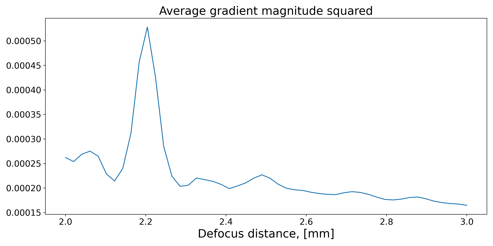
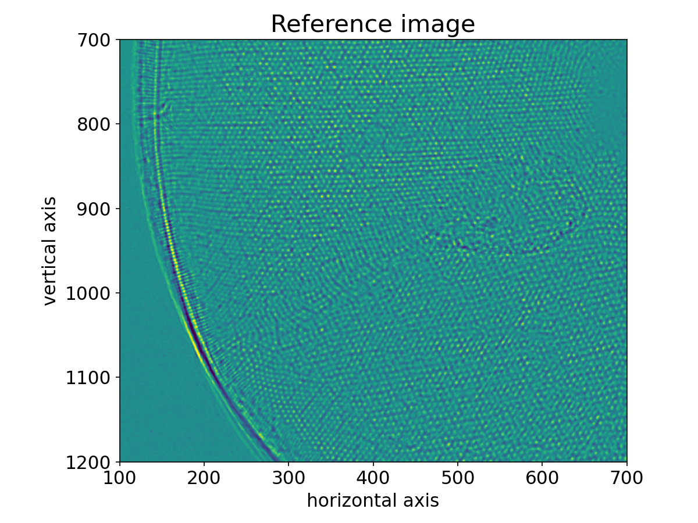
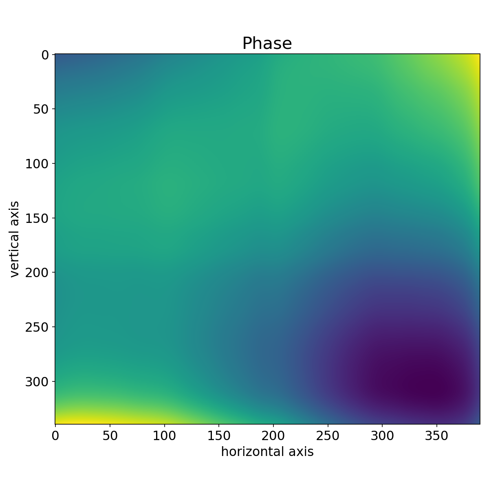
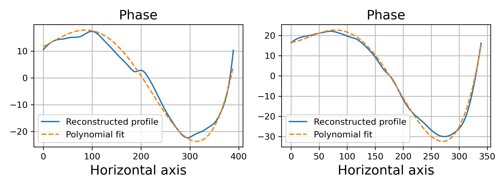

Speckle Tracking of the Diatom Dataset
======================================

Diatom dataset CXI File
-----------------------
First download the `diatom.cxi <https://www.cxidb.org/data/134/diatom.cxi>`_
file from the `CXIDB <https://www.cxidb.org/>`_. The file has the following
structure:

.. code-block:: console

    $ h5ls -r results/diatom.cxi
    /                        Group
    /entry_1                 Group
    /entry_1/data_1          Group
    /entry_1/data_1/data     Dataset {121, 516, 1556}
    /entry_1/data_1/experiment_identifier Dataset {121}
    /entry_1/end_time        Dataset {SCALAR}
    /entry_1/experiment_identifier Dataset, same as /entry_1/data_1/experiment_identifier
    /entry_1/instrument_1    Group
    /entry_1/instrument_1/detector_1 Group
    /entry_1/instrument_1/detector_1/basis_vectors Dataset {121, 2, 3}
    /entry_1/instrument_1/detector_1/corner_positions Dataset {121, 3}
    /entry_1/instrument_1/detector_1/count_time Dataset {121, 1}
    /entry_1/instrument_1/detector_1/data Dataset, same as /entry_1/data_1/data
    /entry_1/instrument_1/detector_1/distance Dataset {SCALAR}
    /entry_1/instrument_1/detector_1/experiment_identifier Dataset, same as /entry_1/data_1/experiment_identifier
    /entry_1/instrument_1/detector_1/mask Dataset {516, 1556}
    /entry_1/instrument_1/detector_1/name Dataset {SCALAR}
    /entry_1/instrument_1/detector_1/x_pixel_size Dataset {SCALAR}
    /entry_1/instrument_1/detector_1/y_pixel_size Dataset {SCALAR}
    /entry_1/instrument_1/name Dataset {SCALAR}
    /entry_1/instrument_1/source_1 Group
    /entry_1/instrument_1/source_1/energy Dataset {SCALAR}
    /entry_1/instrument_1/source_1/name Dataset {SCALAR}
    /entry_1/instrument_1/source_1/wavelength Dataset {SCALAR}
    /entry_1/sample_1        Group
    /entry_1/sample_1/geometry Group
    /entry_1/sample_1/geometry/orientation Dataset {121, 6}
    /entry_1/sample_1/geometry/translation Dataset {121, 3}
    /entry_1/sample_1/name   Dataset {SCALAR}
    /entry_1/start_time      Dataset {SCALAR}

As we can see in :code:`entry_1/data_1/data` the file contains a two-dimensional 11x11 scan,
where each frame is an image of 516x1556 pixels.

Loading the file
----------------
Load the CXI file into a data container :class:`pyrost.STData` with :class:`pyrost.CXILoader`.
:func:`pyrost.CXILoader.import_default` returns the default loader with the default CXI protocol
(:func:`pyrost.CXIProtocol.import_default`).

.. note:: :class:`pyrost.CXILoader` will raise an :class:`AttributeError` while loading the data
    from the CXI file if some of the necessary attributes for Speckle Tracking algorithm
    are not provided. You can see full list of the necessary attributes in
    :class:`pyrost.STData`. Adding the missing attributes to :func:`pyrost.CXILoader.load`
    solves the problem.

.. doctest::

    >>> import pyrost as rst
    >>> loader = rst.CXILoader()
    >>> data = loader.load('results/diatom.cxi') # doctest: +SKIP

Moreover, you can crop the data with the provided region of interest at the detector plane,
or mask bad frames and bad pixels (See :func:`pyrost.STData.crop_data`,
:func:`pyrost.STData.mask_frames`, :func:`pyrost.STData.update_mask`).

.. doctest::

    >>> data = loader.load('results/diatom.cxi', roi=(75, 420, 55, 455), good_frames=np.arange(1, 121))
    >>> data = data.update_mask(method='perc-bad')

OR

.. doctest::

    >>> data = data.crop_data(roi=(75, 420, 55, 455))
    >>> data = data.mask_frames(good_frames=np.arange(1, 121))
    >>> data = data.update_mask(method='perc-bad')

It worked! But still we can not perform the Speckle Tracking update procedure without the
estimates of the defocus distance. You can estimate it with :func:`pyrost.STData.defocus_sweep`.
It generates sample profiles for a set of defocus distances and yields average values
of the gradient magnitude squared (:math:`\left< R[i, j] \right>`, see
:func:`pyrost.STData.defocus_sweep`), which characterizes reference image's shaprness
(the higher is the value the sharper is the reference profile).

.. doctest::

    >>> defoci = np.linspace(2e-3, 3e-3, 50) # doctest: +SKIP
    >>> sweep_scan = data.defocus_sweep(defoci, size=5, ls_ri=1.5)
    >>> defocus = defoci[np.argmax(sweep_scan)] # doctest: +SKIP
    >>> print(defocus) # doctest: +SKIP
    0.002204081632653061

    >>> fig, ax = plt.subplots(figsize=(12, 6)) # doctest: +SKIP
    >>> ax.plot(defoci * 1e3, sweep_scan) # doctest: +SKIP
    >>> ax.set_xlabel('Defocus distance, [mm]', fontsize=20) # doctest: +SKIP
    >>> ax.set_title('Average gradient magnitude squared', fontsize=20) # doctest: +SKIP
    >>> ax.tick_params(labelsize=15) # doctest: +SKIP
    >>> plt.show() # doctest: +SKIP

Let's update the data container with the defocus distance we got. 

.. doctest::

    >>> data = data.update_defocus(defocus)

.. _diatom-st-update:

Speckle Tracking update
-----------------------
Now we're ready to generate a :class:`pyrost.SpeckleTracking` object, which does the heavy
lifting of calculating the pixel mapping between reference plane and detector plane,
and generating the unabberated profile of the sample following the ptychographic speckle
tracking algorithm [ST]_.

For the speckle tracking update you've got two options to choose from:

    * :func:`pyrost.SpeckleTracking.iter_update` : performs the iterative reference image
      and pixel mapping updates with the constant kernel bandwidths for the reference image
      (`ls_ri`) and pixel mapping update (`ls_pm`).

    * :func:`pyrost.SpeckleTracking.iter_update_gd` : does ditto, but updates the bandwidth
      value for the reference image update at each iteration by the help of gradient descent to
      attain the minimal mean-squared-error value.

.. note:: You should pay outmost attention to choose the right kernel bandwidth used for
    reference image and pixel mapping updates (`ls_ri`, `ls_pm`). Essentially they stand for
    the high frequency cut-off imposed during the update, it helps to supress Poisson noise.
    If the values are too high you'll lose useful information. If the values are too low in
    presence of high noise, you won't get accurate results. Moreover, you can change the
    pixel mapping post-update blurring (`blur`), which helps to prevent the noise amplification
    when you perform multiple number of iterations. **As a rule of thumb, `blur` should be several
    times larger than `ls_pm`, and many iterations with small steps (`sw_y`, `sw_x`) are less
    prone to noise than a few iterations with large steps**.

.. note:: Apart from pixel mapping update you may try to perform sample shifts update if you've
    got low precision or credibilily of sample shifts measurements. You can do it by setting
    `update_translations` parameter to True.

.. doctest::

    >>> st_obj = data.get_st()
    >>> st_res = st_obj.iter_update(sw_x=15, sw_y=15, ls_pm=1.5,
    >>>                             ls_ri=0.7, verbose=True, n_iter=5)

    >>> fig, ax = plt.subplots(figsize=(10, 10)) # doctest: +SKIP
    >>> ax.imshow(st_res.reference_image[700:1200, 100:700], vmin=0.7, vmax=1.3,
    >>>           extent=[100, 700, 1200, 700]) # doctest: +SKIP
    >>> ax.set_title('Reference image', fontsize=20) # doctest: +SKIP
    >>> ax.set_xlabel('horizontal axis', fontsize=15) # doctest: +SKIP
    >>> ax.set_ylabel('vertical axis', fontsize=15) # doctest: +SKIP
    >>> ax.tick_params(labelsize=15) # doctest: +SKIP
    >>> plt.show() # doctest: +SKIP

Phase reconstruction
--------------------
We got the pixel map, which can be easily translated to the angular diplacement profile
of the lens wavefront between reference and detector planes. Following the Hartmann sensor
principle (look [ST]_ page 762 for more information), we  reconstruct the lens' phase
profile with :func:`pyrost.STData.update_phase` method. Besides, you can fit the phase
profile with polynomial function using :class:`pyrost.AberrationsFit` fitter object,
which can be obtained with :func:`pyrost.STData.get_fit` method.

.. doctest::

    >>> data.update_phase(st_res)
    >>> fit_obj_ss = data.get_fit(axis=0)
    >>> fit_ss = fit_obj_ss.fit(max_order=3)
    >>> fit_obj_fs = data.get_fit(axis=1)
    >>> fit_fs = fit_obj_fs.fit(max_order=3)

    >>> fig, ax = plt.subplots(figsize=(10, 10)) # doctest: +SKIP
    >>> ax.imshow(data.get('phase')) # doctest: +SKIP
    >>> ax.set_title('Phase', fontsize=20) # doctest: +SKIP
    >>> ax.set_xlabel('horizontal axis', fontsize=15) # doctest: +SKIP
    >>> ax.set_ylabel('vertical axis', fontsize=15) # doctest: +SKIP
    >>> ax.tick_params(labelsize=15) # doctest: +SKIP
    >>> plt.show() # doctest: +SKIP

.. doctest::

    >>> fig, axes = plt.subplots(1, 2, figsize=(16, 6)) # doctest: +SKIP
    >>> axes[0].plot(fit_obj_fs.pixels, fit_obj_fs.phase, label='Reconstructed profile') # doctest: +SKIP
    >>> axes[0].plot(fit_obj_fs.pixels, fit_obj_fs.model(fit_fs['ph_fit']), # doctest: +SKIP
                     label='Polynomial fit') # doctest: +SKIP
    >>> axes[0].set_xlabel('horizontal axis', fontsize=15) # doctest: +SKIP
    >>> axes[1].plot(fit_obj_ss.pixels, fit_obj_ss.phase, label='Reconstructed profile') # doctest: +SKIP
    >>> axes[1].plot(fit_obj_ss.pixels, fit_obj_ss.model(fit_ss['ph_fit']), # doctest: +SKIP
    >>>              label='Polynomial fit') # doctest: +SKIP
    >>> axes[1].set_xlabel('vertical axis') # doctest: +SKIP
    >>> for ax in axes: # doctest: +SKIP
    >>>     ax.set_title('Phase', fontsize=20) # doctest: +SKIP
    >>>     ax.tick_params(labelsize=15) # doctest: +SKIP
    >>>     ax.legend(fontsize=15) # doctest: +SKIP
    >>> plt.show() # doctest: +SKIP

.. _diatom-saving:

Saving the results
------------------
In the end you can save the results to a CXI file.

.. doctest::

    >>> with h5py.File('results/diatom_proc.cxi', 'w') as cxi_file:
    >>>     data.write_cxi(cxi_file)

.. code-block:: console

    $   h5ls -r diatom_proc.cxi
    /                        Group
    /entry_1                 Group
    /entry_1/data_1          Group
    /entry_1/data_1/data     Dataset {121, 516, 1556}
    /entry_1/instrument_1    Group
    /entry_1/instrument_1/detector_1 Group
    /entry_1/instrument_1/detector_1/basis_vectors Dataset {121, 2, 3}
    /entry_1/instrument_1/detector_1/distance Dataset {SCALAR}
    /entry_1/instrument_1/detector_1/x_pixel_size Dataset {SCALAR}
    /entry_1/instrument_1/detector_1/y_pixel_size Dataset {SCALAR}
    /entry_1/instrument_1/source_1 Group
    /entry_1/instrument_1/source_1/wavelength Dataset {SCALAR}
    /entry_1/sample_1        Group
    /entry_1/sample_1/geometry Group
    /entry_1/sample_1/geometry/translations Dataset {121, 3}
    /frame_selector          Group
    /frame_selector/good_frames Dataset {120}
    /speckle_tracking        Group
    /speckle_tracking/error_frame Dataset {516, 1556}
    /speckle_tracking/dfs    Dataset {SCALAR}
    /speckle_tracking/dss    Dataset {SCALAR}
    /speckle_tracking/mask   Dataset {516, 1556}
    /speckle_tracking/phase  Dataset {516, 1556}
    /speckle_tracking/pixel_aberrations Dataset {2, 516, 1556}
    /speckle_tracking/pixel_map Dataset {2, 516, 1556}
    /speckle_tracking/pixel_translations Dataset {121, 2}
    /speckle_tracking/reference_image Dataset {1455, 1498}
    /speckle_tracking/roi    Dataset {4}
    /speckle_tracking/whitefield Dataset {516, 1556}

As you can see all the results have been saved using the same CXI protocol.

References
----------

.. [ST] `"Ptychographic X-ray speckle tracking", Morgan, A. J., Quiney, H. M., Bajt,
        S. & Chapman, H. N. (2020). J. Appl. Cryst. 53, 760-780. <https://doi.org/10.1107/S1600576720005567>`_