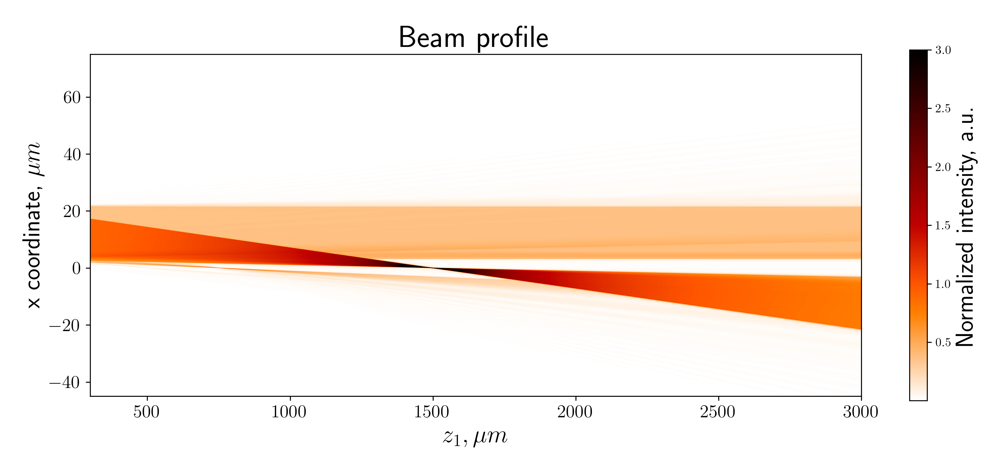

Performing a multislice beam propagation 
========================================

Experimental parameters
-----------------------

Before performing the simulation, you need to define the experimental
parameters. You can do it with :class:`pyrost.multislice.MSParams`.
The ms_sim library has built-in default parameters, which can be
accessed with :func:`pyrost.multislice.MSParams.import_default`.

.. note:: Full list of experimental parameters is written in
    :doc:`../reference/ms_params_ref`. All the spatial parameters are
    assumed to be in microns.

.. doctest::

    >>> import pyrost.multislice as ms_sim
    >>> params = ms_sim.MSParams.import_default()
    >>> params = params.replace(x_step=5e-5, z_step=5e-3, n_min=100, n_max=5000,
    >>>                         focus=1.5e3, mll_sigma=5e-5, mll_wl=6.2e-5, wl=6.2e-5,
    >>>                         x_max=30.0, mll_depth=5.0)

Multilayer Laue lens
--------------------

As a sample, we use a Multilayer Laue lens (MLL).
:class:`pyrost.multislice.MLL` can generate the transmission
profile of the MLL following the zone plate condition.

.. note:: MLL is a volume diffractive element for the efficient
    focusing of X-rays. This diffractive optical element consists of
    alternating layers of two materials, with the thicknesses of each
    layer being set to fulfil the zone plate condition:

    .. math::
        x_n = \sqrt{n f \lambda + n^2 \frac{\lambda^2}{4}} \left(1 - \frac{z}{2 f}\right)

Initialize an :class:`pyrost.multislice.MLL` object with the parameters
`params` as follows:

.. testsetup:: [mll]

    import pyrost.multislice as ms_sim
    params = ms_sim.MSParams.import_default()

.. doctest:: [mll]

    >>> mll = ms_sim.MLL.import_params(params)

Performing the simulation
-------------------------

Now you're able to initialize the :class:`pyrost.multislice.MSPropagator`
propagator, which does the multislice propagation with
:func:`pyrost.multislice.MSPropagator.beam_propagate`. You can
perform the simulation as follows:

.. testsetup:: [ms_prop]

    import pyrost.multislice as ms_sim
    params = ms_sim.MSParams.import_default()
    mll = ms_sim.MLL.import_params(params)

.. doctest:: [ms_prop]
    
    >>> ms_prgt = ms_sim.MSPropagator(params, mll)
    >>> ms_prgt.beam_propagate() # doctest: +SKIP

.. note::

    The results are saved into `ms_prgt.beam_profile` and
    `ms_prgt.smp_profile` attributes. See
    :doc:`../reference/classes/ms_propagator` for the full list
    of attributes.

Whereupon you can generate the beam profile downstream of the sample,
which is comprised of the direct beam and the convergent beam.

.. code-block:: python

    >>> z_arr = np.linspace(0.2 * params.focus, 2.0 * params.focus, 300)
    >>> ds_beam, x_arr = ms_prgt.beam_downstream(z_arr, step=4.0 * params.x_step)

    >>> fig, ax = plt.subplots(1, 1, figsize=(12, 6))
    >>> im1 = ax.imshow(np.abs(ds_beam[::10]), vmax=3., cmap='gist_heat_r',
    >>>                 extent=[z_arr.min(), z_arr.max(), x_arr.min(), x_arr.max()])
    >>> cbar = fig.colorbar(im1, ax=ax, shrink=0.7)
    >>> cbar.ax.set_ylabel('Normalized intensity, a.u.', fontsize=20)
    >>> ax.set_ylabel(r'x coordinate, $\mu m$', fontsize=20)
    >>> ax.set_aspect(10)
    >>> ax.tick_params(labelsize=15)
    >>> ax.set_xlabel(r'$z_1, \mu m$', fontsize=20)
    >>> ax.set_title('Beam profile', fontsize=25)
    >>> plt.show()

