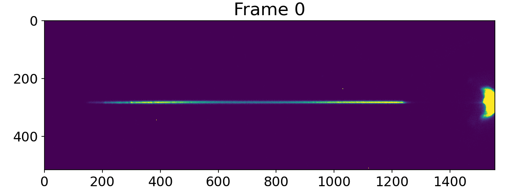
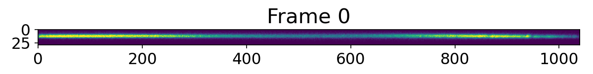
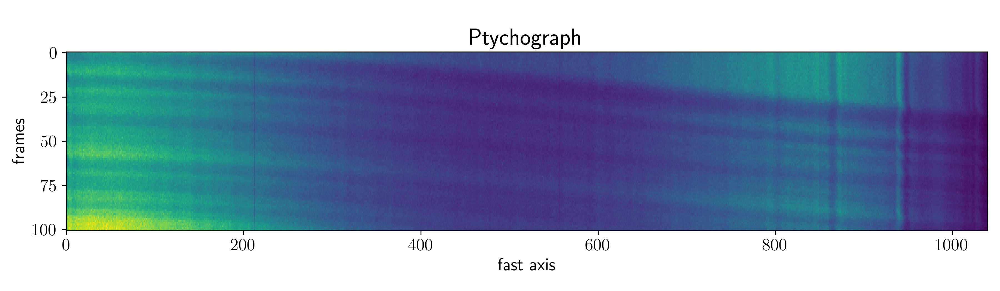
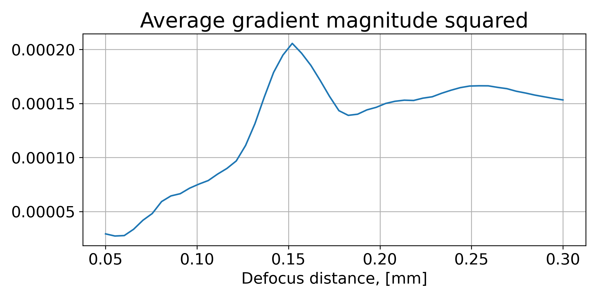
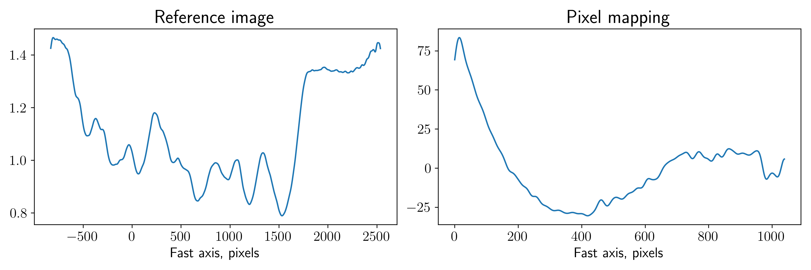
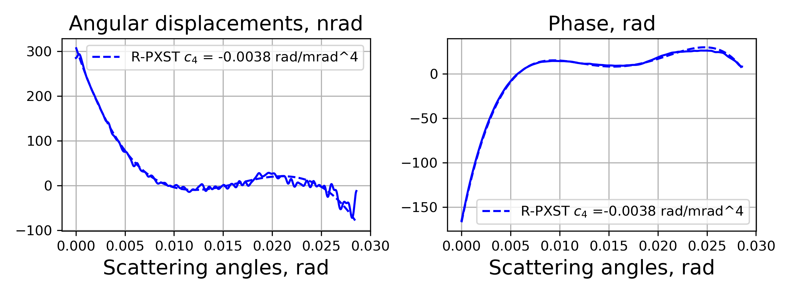

Processing a wavefront metrology experiment
===========================================

Converting raw data at the Sigray lab
-------------------------------------

**For the experiments at the Sigray lab only**

All we need to convert the raw experimental data are a scan number, X-ray target
used during the measurements (Molybdenum, Cupper or Rhodium), and the distance
between a MLL lens and the detector in meters. We parse it to
:func:`pyrost.cxi_converter_sigray` function as follows:

.. code-block:: python

    >>> import pyrost as rst
    >>> data = rst.cxi_converter_sigray(out_path='sigray.cxi', scan_num=2989, target='Mo', distance=2.0)

The function reads the log files and a detector bad pixels mask to initiate `basis_vectors`,
`distance`, `mask`, `translations`, `x_pixel_size`, `y_pixel_size`, and `wavelength` and loads
`data`:

.. code-block:: python

    >>> data.contents()
    ['good_frames', 'wavelength', 'translations', 'basis_vectors', 'data', 'whitefield', 'mask',
    'frames', 'x_pixel_size', 'distance', 'y_pixel_size', 'files', 'num_threads']

.. code-block:: python

    >>> fig, ax = plt.subplots(figsize=(8, 3))
    >>> ax.imshow(data.data[0], vmax=100)
    >>> ax.set_title('Frame 0', fontsize=20)
    >>> ax.tick_params(labelsize=15)
    >>> plt.show()

.. note::
    We may save the data container to a CXI file at any time with :func:`pyrost.STData.save`
    method, see the section :ref:`diatom-saving` in the Diatom dataset tutorial.

Working with the data
---------------------
The function returns a :class:`pyrost.STData` data container, which has a set of utility routines
(see :class:`pyrost.STData` for the full list of methods). Usually the pre-processing of a Sigray
dataset consists of (see :ref:`diatom-preprocessing` for more info):

* Defining a region of interest `[y_min, y_max, x_min, x_max]` (:class:`pyrost.Crop`,
  :func:`pyrost.STData.update_transform`).
* Mirroring the data around the vertical detector axis if needed (:class:`pyrost.Mirror`,
  :func:`pyrost.STData.update_transform`).
* Masking bad pixels (:func:`pyrost.STData.update_mask`).

.. code-block::

    >>> crop = rst.Crop([270, 300, 200, 1240])
    >>> transform = rst.ComposeTransforms([crop, rst.Mirror(axis=1)])
    >>> data = data.update_transform(transform=transform)
    >>> data = data.update_mask(vmax=100000)

.. code-block::

    >>> fig, ax = plt.subplots(figsize=(8, 3))
    >>> ax.imshow(data.data[0], vmax=100)
    >>> ax.set_title('Frame 0', fontsize=20)
    >>> ax.tick_params(labelsize=15)
    >>> plt.show()

* Integrating the stack of frames along the vertical detector axis (:func:`pyrost.STData.integrate_data`).

.. code-block:: python

    >>> data = data.integrate_data()

.. code-block:: python

    >>> fig, ax = plt.subplots(figsize=(8, 3))
    >>> ax.imshow(data.data[:, 0])
    >>> ax.set_title('Ptychograph', fontsize=20)
    >>> ax.set_xlabel('horizontal axis', fontsize=15)
    >>> ax.set_ylabel('frames', fontsize=15)
    >>> ax.tick_params(labelsize=15)
    >>> plt.show()

* Estimating the focus-to-sample distance (:func:`pyrost.STData.defocus_sweep`, :func:`pyrost.STData.update_defocus`).

.. code-block:: python

    >>> defoci = np.linspace(50e-6, 300e-6, 50)
    >>> sweep_scan = data.defocus_sweep(defoci, size=50)
    >>> defocus = defoci[np.argmax(sweep_scan)]
    >>> print(defocus)
    0.00015204081632653058

    >>> fig, ax = plt.subplots(figsize=(8, 4))
    >>> ax.plot(defoci * 1e3, sweep_scan)
    >>> ax.set_xlabel('Defocus distance, [mm]', fontsize=15)
    >>> ax.set_title('Average gradient magnitude squared', fontsize=20)
    >>> ax.tick_params(labelsize=15)
    >>> ax.grid(True)
    >>> plt.show()

Let's update the data container with the defocus distance we got. 

.. code-block:: python

    >>> data = data.update_defocus(defocus)

Speckle tracking update
-----------------------
The steps to perform the speckle tracking update are also the same as in :ref:`diatom-st-update`:

* Create a :class:`pyrost.SpeckleTracking` object.
* Find an optimal kernel bandwidth with :func:`pyrost.SpeckleTracking.find_hopt`.
* Perform the iterative R-PXST update  with :func:`pyrost.SpeckleTracking.train`
  or :func:`pyrost.SpeckleTracking.train_adapt`.

.. code-block:: python

    >>> st_obj = data.get_st()
    >>> h0 = st_obj.find_hopt()
    >>> st_res = st_obj.train_adapt(search_window=(0.0, 10.0, 0.1), h0=h0, blur=8.0)

    >>> fig, axes = plt.subplots(1, 2, figsize=(8, 3))
    >>> axes[0].plot(np.arange(st_res.reference_image.shape[1]) - st_res.ref_orig[1],
    >>>              st_res.reference_image[0])
    >>> axes[0].set_title('Reference image', fontsize=20)
    >>> axes[1].plot((st_res.pixel_map - st_obj.pixel_map)[1, 0])
    >>> axes[1].set_title('Pixel mapping', fontsize=20)
    >>> for ax in axes:
    >>>     ax.tick_params(labelsize=10)
    >>>     ax.set_xlabel('Fast axis, pixels', fontsize=15)
    >>>     ax.grid(True)
    >>> plt.show()

After we successfully reconstructed the wavefront with :func:`pyrost.SpeckleTracking.train_adapt`
we are able to update the :class:`pyrost.STData` container with :func:`pyrost.STData.import_st`
method.

.. code-block:: python

    >>> data.import_st(st_res)

Phase fitting
-------------
In the end we want to look at a angular displacement profile of the X-ray beam and
find the fit to the profile with a polynomial. All of it could be done with 
:class:`pyrost.AberrationsFit` fitter object, which can be obtained with
:func:`pyrost.STData.get_fit` method. We may parse the direct beam coordinate
in pixels to center the scattering angles aroung the direction of the direct beam:

.. code-block:: python

    >>> fit_obj = data.get_fit(axis=1)
    
Moreover we would like to remove the first order polynomial term from the displacement
profile with the :func:`pyrost.AberrationsFit.remove_linear_term`, since it
characterizes the beam's defocus and is of no interest to us. After that, you
can obtain the best fit to the displacement profile with :func:`pyrost.AberrationsFit.fit`
and to the phase profile with :func:`pyrost.AberrationsFit.fit_phase`:

.. code-block:: python

    >>> fit_obj = fit_obj.remove_linear_term()
    >>> fit = fit_obj.fit(max_order=3)

    >>> fig, axes = plt.subplots(1, 2, figsize=(8, 3))
    >>> axes[0].plot(fit_obj.thetas, fit_obj.theta_ab * 1e9, 'b')
    >>> axes[0].plot(fit_obj.thetas, fit_obj.model(fit['fit']) * fit_obj.ref_ap * 1e9,
    >>>              'b--', label=fr"R-PXST $c_4$ = {fit['c_4']:.4f} rad/mrad^4")
    >>> axes[0].set_title('Angular displacements, nrad', fontsize=15)
    >>> 
    >>> axes[1].plot(fit_obj.thetas, fit_obj.phase, 'b')
    >>> axes[1].plot(fit_obj.thetas, fit_obj.model(fit['ph_fit']), 'b--',
    >>>              label=fr"R-PXST $c_4$ ={fit['c_4']:.4f} rad/mrad^4")
    >>> axes[1].set_title('Phase, rad', fontsize=15)
    >>> for ax in axes:
    >>>     ax.legend(fontsize=10)
    >>>     ax.tick_params(labelsize=10)
    >>>     ax.set_xlabel('Scattering angles, rad', fontsize=15)
    >>>     ax.grid(True)
    >>> plt.show()

