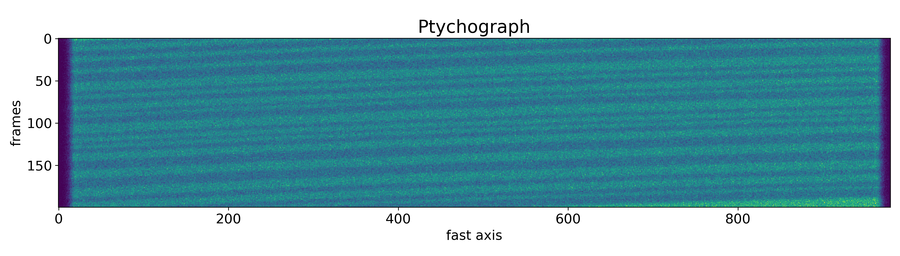

Speckle Tracking Simulation
===========================

You can simulate an one-dimensional Speckle Tracking scan either using
Python interface or Terminal.

Python interface
----------------

Experimental parameters
^^^^^^^^^^^^^^^^^^^^^^^

Before performing the simulation, you need to choose experimental
parameters. You can do it with :class:`pyrost.simulation.STParams` or
:func:`pyrost.simulation.parameters`.

.. note:: Full list of experimental parameters is written in
    :doc:`../reference/st_params_ref`. All the spatial parameters are
    assumed to be in microns.

.. doctest::

    >>> import pyrost.simulation as st_sim
    >>> params = st_sim.parameters(bar_size=0.7, bar_sigma=0.12, bar_atn=0.18,
    >>>                            bulk_atn=0.2, p0 = 5e4, th_s=8e-5, n_frames=100,
    >>>                            offset=2.0, step_size=0.1, defocus=150, alpha=0.05,
    >>>                            ab_cnt=0.7, bar_rnd=0.8)

Performing the simulation
^^^^^^^^^^^^^^^^^^^^^^^^^

Now you're able to generate the simulated data. It takes time to calculate the
wavefronts, :class:`pyrost.simulation.STSim` will post it's status during the process. You can
either generate a stack of frames or a ptychograph. :class:`pyrost.simulation.STConverter`
saves the results to a CXI file using the provided CXI protocol.

.. doctest::

    >>> sim_obj = st_sim.STSim(params)
    >>> ptych = sim_obj.ptychograph()
    >>> st_conv = st_sim.STConverter()
    >>> st_conv.save_sim(ptych, sim_obj, 'results/sim_results')

    >>> fig, ax = plt.subplots(figsize=(14, 6)) # doctest: +SKIP
    >>> ax.imshow(ptych[:, 0, 500:1480]) # doctest: +SKIP
    >>> ax.set_title('Ptychograph', fontsize=20) # doctest: +SKIP
    >>> ax.tick_params(labelsize=15) # doctest: +SKIP
    >>> plt.show() # doctest: +SKIP

Or you can directly generate an :class:`pyrost.STData` data container to perform the Speckle Tracking algorithm.

.. doctest::

    >>> sim_obj = st_sim.STSim(params)=
    >>> ptych = sim_obj.ptychograph()
    >>> st_conv = st_sim.STConverter()
    >>> st_data = st_conv.export_data(ptych, sim_obj)

Command-line interface
----------------------

You can perform the whole simulation procedure with one command :code:`python -m pyrost.simulation`. To see all available arguments
just type :code:`python -m pyrost.simulation --help`.

.. code-block:: console

    $ python -m pyrost.simulation --help      
    usage: __main__.py [-h] [-f INI_FILE] [--defocus DEFOCUS]
                       [--det_dist DET_DIST] [--step_size STEP_SIZE]
                       [--n_frames N_FRAMES] [--fs_size FS_SIZE]
                       [--ss_size SS_SIZE] [--p0 P0] [--wl WL] [--th_s TH_S]
                       [--ap_x AP_X] [--ap_y AP_Y] [--focus FOCUS] [--alpha ALPHA]
                       [--ab_cnt AB_CNT] [--bar_size BAR_SIZE] [--bar_sigma BAR_SIGMA]
                       [--bar_atn BAR_ATN] [--bulk_atn BULK_ATN]
                       [--bar_rnd BAR_RND] [--offset OFFSET] [-v] [-p]
                       out_path

    Run Speckle Tracking simulation

    positional arguments:
      out_path              Output folder path

    optional arguments:
      -h, --help            show this help message and exit
      -f INI_FILE, --ini_file INI_FILE
                            Path to an INI file to fetch all of the simulation
                            parameters (default: None)
      --defocus DEFOCUS     Lens defocus distance, [um] (default: 400.0)
      --det_dist DET_DIST   Distance between the barcode and the detector [um]
                            (default: 2000000.0)
      --step_size STEP_SIZE
                            Scan step size [um] (default: 0.1)
      --n_frames N_FRAMES   Number of frames (default: 300)
      --fs_size FS_SIZE     Fast axis frames size in pixels (default: 2000)
      --ss_size SS_SIZE     Slow axis frames size in pixels (default: 1000)
      --p0 P0               Source beam flux [cnt / s] (default: 200000.0)
      --wl WL               Wavelength [um] (default: 7.29e-05)
      --th_s TH_S           Source rocking curve width [rad] (default: 0.0002)
      --ap_x AP_X           Lens size along the x axis [um] (default: 40.0)
      --ap_y AP_Y           Lens size along the y axis [um] (default: 2.0)
      --focus FOCUS         Focal distance [um] (default: 1500.0)
      --alpha ALPHA         Third order abberations [rad/mrad^3] (default: -0.05)
      --ab_cnt AB_CNT       Lens' abberations center point [0.0 - 1.0] (default:
                            0.5)
      --bar_size BAR_SIZE   Average bar size [um] (default: 0.1)
      --bar_sigma BAR_SIGMA
                            Bar haziness width [um] (default: 0.01)
      --bar_atn BAR_ATN     Bar attenuation (default: 0.3)
      --bulk_atn BULK_ATN   Bulk attenuation (default: 0.0)
      --bar_rnd BAR_RND     Bar random deviation (default: 0.6)
      --offset OFFSET       sample's offset at the beginning and the end of the
                            scan [um] (default: 0.0)
      -v, --verbose         Turn on verbosity (default: True)
      -p, --ptych           Generate ptychograph data (default: False)

    $ python -m pyrost.simulation results/sim_results --bar_size 0.7 --bar_sigma 0.12 \
    --bar_atn 0.18 --bulk_atn 0.2 --p0 5e4 --th_s 8e-5 --n_frames 200 --offset 2 \
    --step_size 0.1 --defocus 150 --alpha 0.05 --ab_cnt 0.7 --bar_rnd 0.8 -p -v
    The simulation results have been saved to results/sim_results

As you can see below, the simulated Speckle Tracking scan was saved to a CXI file.

.. code-block:: console

    $ h5ls -r results/sim_results/data.cxi
    /                        Group
    /entry_1                 Group
    /entry_1/data_1          Group
    /entry_1/data_1/data     Dataset {200, 1, 2000}
    /entry_1/instrument_1    Group
    /entry_1/instrument_1/detector_1 Group
    /entry_1/instrument_1/detector_1/basis_vectors Dataset {200, 2, 3}
    /entry_1/instrument_1/detector_1/distance Dataset {SCALAR}
    /entry_1/instrument_1/detector_1/x_pixel_size Dataset {SCALAR}
    /entry_1/instrument_1/detector_1/y_pixel_size Dataset {SCALAR}
    /entry_1/instrument_1/source_1 Group
    /entry_1/instrument_1/source_1/energy Dataset {SCALAR}
    /entry_1/instrument_1/source_1/wavelength Dataset {SCALAR}
    /entry_1/sample_1        Group
    /entry_1/sample_1/geometry Group
    /entry_1/sample_1/geometry/translations Dataset {200, 3}
    /frame_selector          Group
    /frame_selector/good_frames Dataset {200}
    /speckle_tracking        Group
    /speckle_tracking/defocus Dataset {SCALAR}
    /speckle_tracking/mask   Dataset {1, 2000}
    /speckle_tracking/roi    Dataset {4}
    /speckle_tracking/whitefield Dataset {1, 2000}